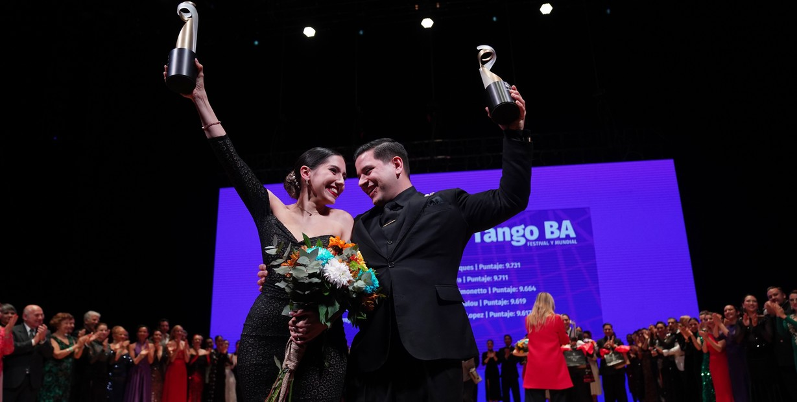

# Statistical Analysis on Scoring Bias: 2024 Argentine Tango World Championship

In this project I perform a thorough statistical analysis on the biases present in scoring dance competitors in the world's largest and most recognized Argentine Tango competition held in Buenos Aires, Argentine every year. 