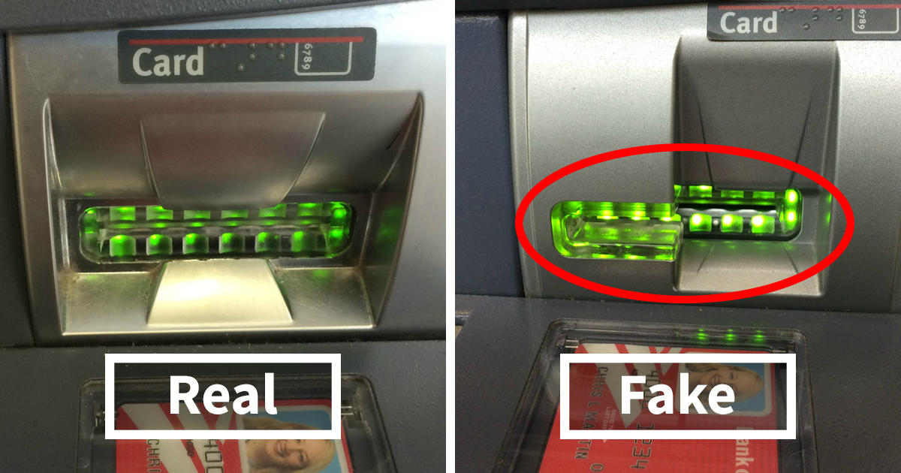

# Machine Learning Pipeline for Bank Fraud 

-------
## Summary 

This software is designed to load, clean, and perform a series data transformations in preperation for the ML pipeline that trains a series of models for detection fradulent banking activity. 

## Data Preperation 

The `prep_data` class performs the following data transformations:
- Drops low variance features
- Distinguishes between categorical and numerical features
- Identifies and removes any outliers
- Balances imbalanced labels 

Check out the `EDA` notebook for a detailed overview.

## ML Pipeline 

The `train_models` class performs the following: 
- create_transform_portion_of_pipeline
- Creates a data transform pipeline that handels categorical and numerical features differently
- Performs a grid search for each pipeline object
- Trains a list of default ML models but allows the user to pass in a custom list 
- Logs the performance of each pipeline
- Saves best pipeline to file

Check out the `Modeling` notebook for a detailed overview.

## Set up
1) Download and install [Anaconda](https://www.anaconda.com/)
2) In the terminal, navigate over to the `Scripts` directory
3) Run `pip install -r requirements.txt` 
4) Run `python -m run` 